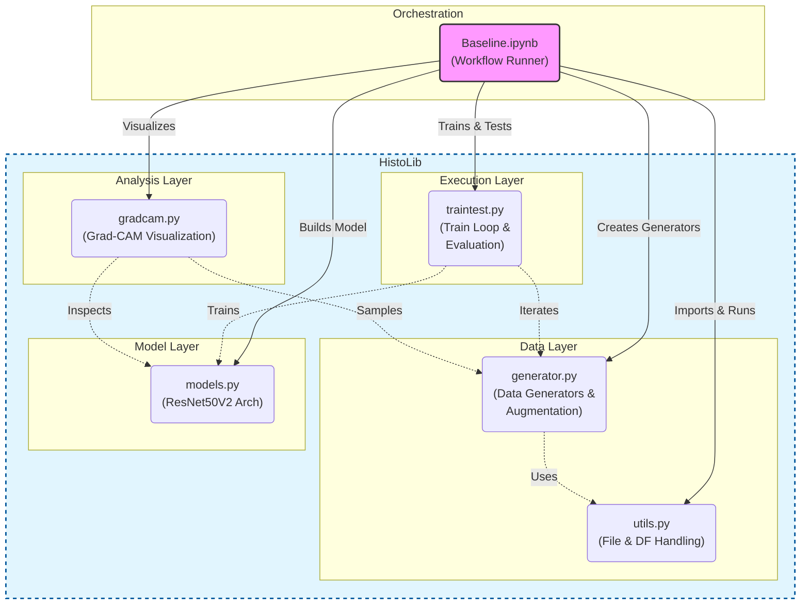

# LungHist700 Codebase Architecture

This codebase is designed for training and evaluating a deep learning model (specifically ResNet50V2) on histological lung images (`LungHist700` dataset). It uses a modular approach where core functionalities are encapsulated within the `HistoLib` library, and the workflow is orchestrated by a Jupyter Notebook.

## Component Overview

### 1. Orchestrator
- **`Baseline.ipynb`**: This is the main entry point. It orchestrates the entire pipeline:
    - Setting up data generators.
    - creating and compiling the model.
    - Training the model.
    - Evaluating performance (metrics, confusion matrix).
    - Visualizing model attention using Grad-CAM.

### 2. HistoLib Library
The core logic is divided into specialized modules:

- **`HistoLib/utils.py` (Utilities)**:
    - Handles file system operations (finding images).
    - Manages metadata (creating dataframes from CSVs).
    - Performs patient-level train/test splitting to ensure no data leakage.
    - Computes class weights for handling imbalanced datasets.

- **`HistoLib/generator.py` (Data Loading & Augmentation)**:
    - Defines `CustomDataGenerator` (inherits from `keras.utils.Sequence`) for efficient data loading.
    - Implements heavy data augmentation using `albumentations` (flips, distortions, color shifts).
    - Provides `get_patient_generators` to easily create train/val/test generators based on patient splits.

- **`HistoLib/models.py` (Model Definition)**:
    - Defines the deep learning architecture.
    - Currently implements `resnet_model`, which uses a pre-trained **ResNet50V2** as a base, followed by custom dense and dropout layers for classification.

- **`HistoLib/traintest.py` (Training & Evaluation)**:
    - `compile_model`: Sets up the optimizer (Adam), loss function (Categorical Crossentropy), and a comprehensive list of metrics (Accuracy, AUC, F1, Precision, Recall).
    - `train_model`: Manages the training loop with callbacks for Early Stopping, Learning Rate Reduction, and Checkpointing.
    - `metrics_and_test`: Visualizes training history and generates confusion matrices/evaluation reports on the test set.

- **`HistoLib/gradcam.py` (Interpretability)**:
    - Implements Gradient-weighted Class Activation Mapping (Grad-CAM).
    - `generate_gradcam_samples`: Visualizes which parts of the histological images influenced the model's predictions, superimposing heatmaps on the original images.

## Architecture Diagram

## Data Flow

1.  **Initialization**: `Baseline.ipynb` calls `generator.get_patient_generators`, which uses `utils.py` to load metadata and split data by patient ID.
2.  **Model Setup**: `Baseline.ipynb` calls `models.get_model` to instantiate the ResNet50V2 model.
3.  **Training**: `Baseline.ipynb` passes the model and generators to `traintest.train_model`.
4.  **Evaluation**: Trained model performance is assessed using `traintest.metrics_and_test`.
5.  **Insight**: `gradcam.py` uses the trained model and test generator to produce heatmaps, aiding in understanding the model's focus.
